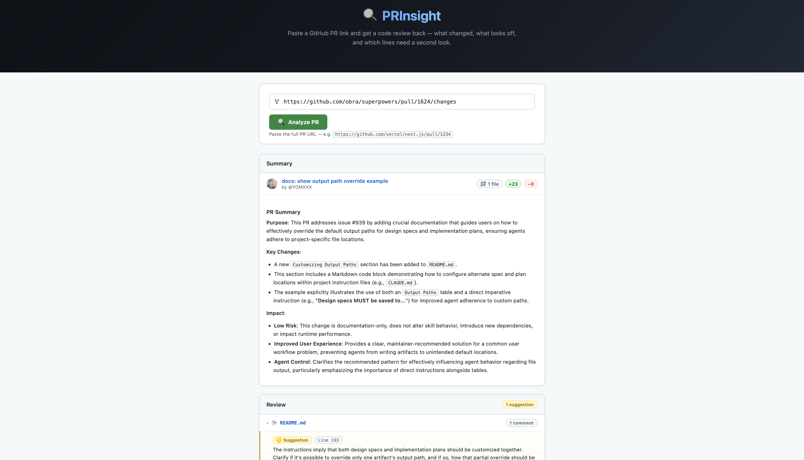
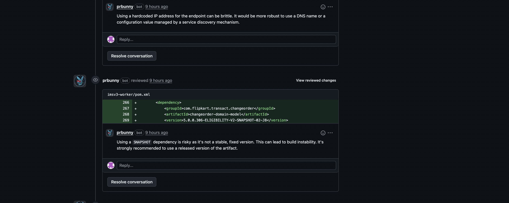

# PRInsight

I got tired of waiting for code reviews, so I built this. It hooks into GitHub, reads your PR diff, sends it to Gemini, and posts the review comments back — same as a human reviewer would, just faster.

It can run three ways depending on what you need:

- **GitHub Action** — drop a workflow file in your repo and forget about it. Every PR gets reviewed automatically.
- **Webhook server** — run it on your own machine or a VPS and point GitHub at it.
- **Web app** — paste a PR link and read the analysis right in the browser. Good for one-off reviews.

---

## Screenshots

**Web UI — analyzing a PR**


**Web UI — summary and review results**


**GitHub — inline comments posted directly on the PR**


---

## What it actually does

When a PR is opened, PRInsight:

1. Fetches the raw diff from GitHub
2. Filters out lockfiles, images, and generated files
3. Sends the diff to Gemini with two prompts — one for a summary, one for a code review
4. Posts the summary as a PR comment
5. Posts inline review comments on the specific lines with issues
6. Adds a collapsible digest at the bottom so you can copy everything at once

Each review comment is marked `[critical]` (actual bug, security issue, logic error) or `[suggestion]` (could be better, but won't break anything).

If the diff is too large (>2000 lines) or has no source files, it posts a comment explaining why it skipped instead of silently doing nothing.

---

## GitHub Action setup

This is the easiest way. No server, no configuration beyond one secret.

**Step 1** — copy `.github/workflows/prinsight.yml` into your repo. The file is already in this project, so if you're using PRInsight itself, it's already there.

```yaml
name: PRInsight AI Review

on:
  pull_request:
    types: [opened, synchronize, reopened]

jobs:
  review:
    runs-on: ubuntu-latest
    permissions:
      pull-requests: write
      contents: read
    steps:
      - uses: actions/checkout@v4
      - uses: actions/setup-node@v4
        with:
          node-version: '20'
          cache: 'npm'
      - run: npm ci
      - run: node src/action.js
        env:
          GITHUB_TOKEN: ${{ secrets.GITHUB_TOKEN }}
          GEMINI_API_KEY: ${{ secrets.GEMINI_API_KEY }}
          REPO_OWNER: ${{ github.repository_owner }}
          REPO_NAME: ${{ github.event.repository.name }}
          PR_NUMBER: ${{ github.event.pull_request.number }}
```

**Step 2** — add `GEMINI_API_KEY` as a repository secret.

Go to your repo → Settings → Secrets and variables → Actions → New repository secret. Get the key from [Google AI Studio](https://aistudio.google.com) (free).

`GITHUB_TOKEN` is already available in every Action run — GitHub injects it automatically.

That's it. Open a PR and it'll review it.

---

## Webhook server setup

Use this if you want one server handling multiple repos, or if you don't want to add a workflow file to every project.

**What you need:**

- Node.js 18+
- A Gemini API key from [Google AI Studio](https://aistudio.google.com)
- A GitHub personal access token (needs `repo` and `issues` scopes)
- A public URL — use [ngrok](https://ngrok.com) if you're running locally

**Install:**

```bash
git clone https://github.com/<your-username>/PRInsight.git
cd PRInsight
npm install
cp .env.example .env
```

Edit `.env`:

```
GITHUB_TOKEN=ghp_xxxx
GITHUB_WEBHOOK_SECRET=pick_any_string_here
GEMINI_API_KEY=your_key_here
PORT=3000
```

**Start the server:**

```bash
npm run dev        # restarts on file changes
npm start          # production
```

**Expose it to GitHub (local dev):**

```bash
ngrok http 3000
# copy the https://xxxx.ngrok.io URL
```

**Register the webhook on GitHub:**

Go to your repo → Settings → Webhooks → Add webhook.

- Payload URL: `https://xxxx.ngrok.io/webhook`
- Content type: `application/json`
- Secret: whatever you set as `GITHUB_WEBHOOK_SECRET`
- Events: check "Pull requests" and "Issue comments"

Check it's running:

```bash
curl http://localhost:3000/health
```

**Re-trigger a review manually:**

Post a comment on any PR with just:

```
prinsight-review
```

It'll re-run on the current state of the diff. Useful after you've pushed fixes and want a fresh pass.

---

## Web app

Good for reviewing someone else's PR, or checking a one-off thing without setting up a webhook.

```bash
npm run setup        # installs root + client dependencies

# in one terminal
npm run dev          # API server on port 3000

# in another terminal
npm run dev:client   # React app on port 5173
```

Open http://localhost:5173, paste a GitHub PR URL, click Analyze.

For production, build the client first and then start the server — it serves everything from one port:

```bash
npm run build:client
npm start
```

---

## Deploying to production (Render + Vercel)

The backend runs on Render, the frontend runs on Vercel. The custom domain `prinsight.kritika.online` points to Vercel; the API lives at `api.prinsight.kritika.online` on Render.

### 1. Deploy the backend on Render

1. Go to [render.com](https://render.com) → New → Web Service
2. Connect your GitHub repo
3. Render will pick up `render.yaml` automatically — it sets the build and start commands
4. Add these environment variables manually in the Render dashboard (they're marked `sync: false` in the config so they don't end up in the repo):
   - `GITHUB_TOKEN`
   - `GITHUB_WEBHOOK_SECRET`
   - `GEMINI_API_KEY`
5. Once deployed, go to Settings → Custom Domains → add `api.prinsight.kritika.online`
6. Render gives you a CNAME value — add it to your DNS (wherever `kritika.online` is managed)

### 2. Deploy the frontend on Vercel

1. Go to [vercel.com](https://vercel.com) → New Project → import your GitHub repo
2. Vercel picks up `vercel.json` — it builds `client/` and serves `client/dist`
3. Add this environment variable in the Vercel dashboard:
   - `VITE_API_URL` → `https://api.prinsight.kritika.online`
4. Go to Settings → Domains → add `prinsight.kritika.online`
5. Vercel gives you a CNAME — add it to your DNS

### 3. DNS records

Add these two records wherever `kritika.online` is hosted (Namecheap, Cloudflare, GoDaddy, etc.):

| Type | Name | Value |
|---|---|---|
| CNAME | `prinsight` | given by Vercel |
| CNAME | `api.prinsight` | given by Render |

DNS can take a few minutes to an hour to propagate.

### 4. Verify

```bash
curl https://api.prinsight.kritika.online/health
# should return: {"status":"ok","service":"PRInsight","version":"1.0.0"}
```

Then open https://prinsight.kritika.online and paste a PR URL.

> **Note:** Render's free tier spins down after 15 minutes of inactivity. The first request after sleep takes ~30 seconds. Upgrade to a paid instance if you need it always-on.

---

## Environment variables

**Backend (.env or Render dashboard)**

| Variable | What it's for |
|---|---|
| `GITHUB_TOKEN` | Reads diffs and posts comments. Needs `repo` + `issues` scope. |
| `GITHUB_WEBHOOK_SECRET` | Validates that events actually came from GitHub. |
| `GEMINI_API_KEY` | The AI that does the reviewing. |
| `FRONTEND_URL` | Your Vercel URL — used for the CORS allow-origin header. |
| `PORT` | Defaults to 3000. |

**Frontend (client/.env or Vercel dashboard)**

| Variable | What it's for |
|---|---|
| `VITE_API_URL` | Points the React app at your Render backend. Empty in local dev. |

---

## Project layout

```
PRInsight/
├── .github/workflows/
│   └── prinsight.yml       # GitHub Action — auto-reviews PRs in CI
├── client/                 # React frontend (deployed to Vercel)
│   ├── src/
│   │   ├── App.jsx
│   │   └── components/
│   │       ├── PRInput.jsx
│   │       ├── Summary.jsx
│   │       ├── ReviewComments.jsx
│   │       └── Loader.jsx
│   ├── .env.example
│   └── vite.config.js      # proxies /api to :3000 in local dev
├── src/                    # Express backend (deployed to Render)
│   ├── index.js
│   ├── webhook.js
│   ├── github.js
│   ├── diffParser.js
│   ├── gemini.js
│   ├── reviewer.js
│   ├── action.js           # entry point for GitHub Action runs
│   └── routes/
│       └── analyze.js      # POST /api/analyze — used by the web app
├── render.yaml             # Render deployment config
├── vercel.json             # Vercel deployment config
├── .env.example
└── package.json
```

---

## Tech

- **Express.js** — webhook server and API
- **React + Vite** — web UI
- **Gemini 2.5 Flash** — the AI model doing the reviewing
- **HMAC-SHA256** — webhook signature verification

---

## License

MIT
